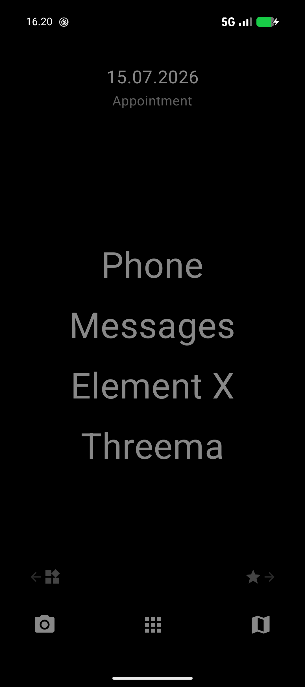
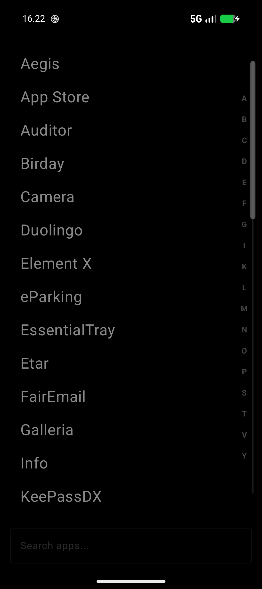
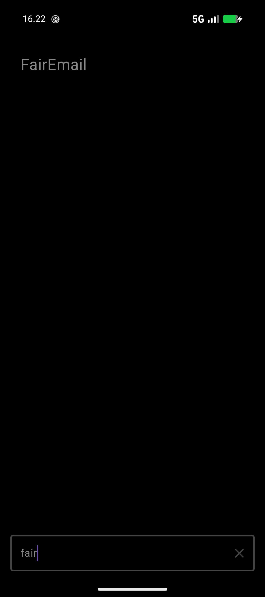

# EssentialTray

**EssentialTray** is a minimalist, text-based Android launcher designed for high productivity and deep privacy. It strips away distractions, focusing on your most-used apps and providing seamless integration with Android 15's Private Space.

Version: **1.0**

## 🌟 Features

-   **Minimalist Interface**: A clean, text-driven UI that reduces visual clutter.
-   **Android 15 Private Space Integration**:
    -   Identify private apps with a dedicated lock icon.
    -   Lock and unlock your Private Space directly from the app drawer.
    -   **Split-View Mode**: Keep your private and public apps separated in two distinct, scrollable lists.
-   **Smart App Drawer**:
    -   Fast search with tag support.
    -   Alphabetical sidebar for quick navigation.
    -   Custom scrollbars with precise finger tracking.
-   **Productivity Tools**:
    -   **Favorites**: Keep up to 8 essential apps on your home screen.
    -   **Popular Apps**: Automatically tracks and displays your most frequently used apps.
    -   **Widgets Support**: A dedicated screen for your essential widgets with adjustable heights.
    -   **Calendar & Quotes**: Display upcoming events or personal motivational quotes on your home screen.
-   **Customization**:
    -   Rename apps and add custom tags for better organization.
    -   Hide apps you don't need to see.
-   **Gestures**:
    -   Swipe up for All Apps.
    -   Swipe left/right for Popular apps and Widgets.
    -   Double-tap to sleep (requires Accessibility Service).
    -   Long press home for notifications.

## 📸 Screenshots

  
  
  

## ⚖️ License

Licensed under the **Apache License, Version 2.0**. See the [LICENSE](LICENSE) file for more details.

---
*Created by Boris55555*
